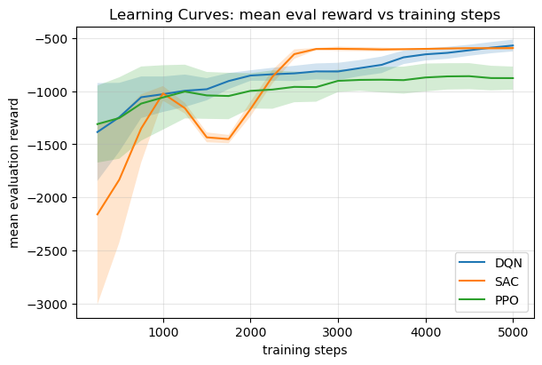
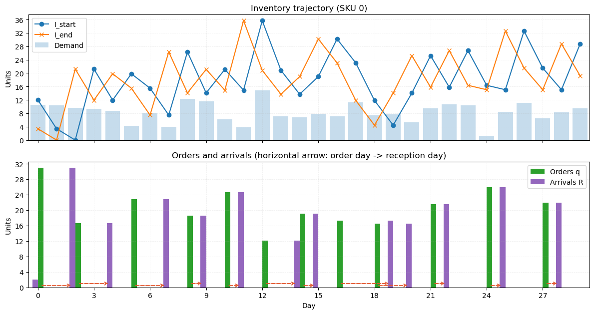
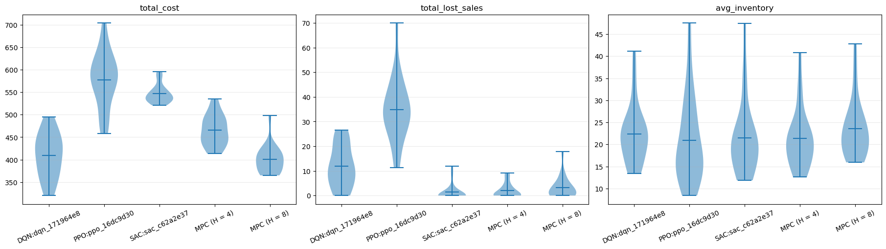

# Inventory Control with MPC and RL

Experimentation framework that allows the creation and evaluation of autonomous agents to make replenishment decisions on a stochastic SKU inventory control scenario.

The decision agents can be based on two complementary approaches:
- Model Predictive Control (MPC) built with [Pyomo](https://github.com/Pyomo/pyomo).
- Reinforcement Learning (RL) built on [Gymnasium](https://github.com/Farama-Foundation/Gymnasium) and [Stable-Baselines3](https://github.com/DLR-RM/stable-baselines3).

The framework provides a compact but complete workflow for:
- modeling the inventory dynamics,
- training and registering RL agents,
- evaluating RL and MPC policies on shared scenarios,
- and comparing their KPI distributions.

## System Dynamics

The controlled environment is a single-SKU lost-sales inventory system with uncertain demand and stochastic lead time.

At each period $k$ and scenario $s$:
- $I_{k,s}$ is the on-hand inventory at the start of the period.
- $D_{k,s}$ is the realized demand.
- $P_{k,s,\ell}$ is the pipeline inventory scheduled to arrive in $\ell$ periods.
- $R_{k,s}$ is the inventory arriving now, defined as $P_{k,s,1}$.
- $\ell_{k,s}$ is lost sales, used when demand exceeds available stock.
- $q_k$ is the replenishment order placed at period $k$.

The inventory balance is:
- arrivals become available at the start of the decision stage,
- unmet demand is counted as lost sales,
- next-period inventory is $I_{k+1,s} = I_{k,s} + R_{k,s} - D_{k,s} + \ell_{k,s}$.

The pipeline shifts forward one step every period:
- inventory scheduled for $\ell+1$ periods moves to $\ell$,
- the last position is emptied,
- the new order $q_k$ is injected into the pipeline at the position determined by the realized lead time.

This is the common system model used by both MPC and RL. The precise mathematical specification is documented in [docs/spec_mpc_single_sku.md](docs/spec_mpc_single_sku.md).

## Installation

### Requirements
- Python `3.11`
- `pip` and `venv`

### 1. Clone the repository

```bash
git clone https://github.com/jjalcaraz-upct/inventory-control
cd Inventory
```

### 2. Create a virtual environment

```bash
python3.11 -m venv .venv
source .venv/bin/activate
python -m pip install --upgrade pip
```

### 3. Install the tested package set

```bash
python -m pip install \
  pyomo==6.10.0 \
  highspy==1.13.1 \
  numpy==2.4.2 \
  pandas==3.0.1 \
  matplotlib==3.10.8 \
  gymnasium==1.2.3 \
  stable-baselines3==2.7.1 \
  torch==2.10.0 \
  jupyterlab==4.5.5 \
  ipython==9.10.0
```

Notes:
- `highspy` provides the HiGHS backend to solve the MILP in Pyomo.
- If you use another solver (`cbc`, `gurobi`), adjust the configuration in the code/notebooks.

### 4. Verify the installation

```bash
python -c "import control_mpc, control_rl; print('imports ok')"
```

## Core Modules

### RL service API

The main RL-facing API is exposed in [control_rl/agents.py](control_rl/agents.py).

Key functions:
- `train_agent(...)`
- `evaluate_agent(...)`
- `register_agent(...)`
- `load_policy(...)`
- `list_registered_agents(...)`
- `get_sku_config(...)`
- `get_learning_curves(...)`

These functions are intended to cover the basic workflow:
1. train an agent,
2. evaluate it,
3. register it,
4. load it later for comparison.

The RL factory currently supports:
- `DQN` for discrete-action policies.
- `A2C` for discrete or continuous policies.
- `PPO` for discrete or continuous policies.
- `SAC` for continuous-action policies.
- `TD3` for continuous-action policies.

### Shared evaluation API

[model/evaluation.py](model/evaluation.py) provides the shared evaluation utilities used by both RL and MPC.

The main entry points are:
- `build_scenario(...)`
- `evaluate_policy(...)`

### MPC policy API

[control_mpc/mpc_policy.py](control_mpc/mpc_policy.py) exposes `MPCPolicy`, a simple policy object with `compute_action(...)` for single-SKU control.

## Notebooks

The notebooks are the recommended entry point for examples.

- [notebooks/rl_training.ipynb](notebooks/rl_training.ipynb): trains RL agents, evaluates them, registers them, and plots learning curves.
- [notebooks/agent_comparison.ipynb](notebooks/agent_comparison.ipynb): loads registered RL agents, adds MPC baselines, and compares KPI distributions with violin plots.
- [notebooks/mpc_visualization.ipynb](notebooks/mpc_visualization.ipynb): step-by-step MPC walkthrough on a single scenario.

## Example Outputs



Learning curves for three RL algorithms: DQN, SAC, and PPO.



Example 30-day single-SKU control trajectory generated with MPC.



KPI comparison between RL agents and MPC policies.

## Scripts

The repository also includes a few small scripts for direct execution:

- [scripts/run_toy.py](scripts/run_toy.py): small simulation and MPC smoke runs.
- [scripts/train_dqn_sac.py](scripts/train_dqn_sac.py): minimal RL workflow for training, evaluation, registration, and learning-curve plotting.
- [scripts/compare_policies.py](scripts/compare_policies.py): compares the first two registered RL agents for one SKU on a shared scenario.
- [scripts/list_registered_rl_agents.py](scripts/list_registered_rl_agents.py): lists registered SKUs and RL agents.
- [scripts/delete_old_agents_for_sku.py](scripts/delete_old_agents_for_sku.py): keeps the most recent agent per algorithm for a given SKU and deletes the older ones.

- [scripts/train_dqn_sac_nonblocking.py](scripts/train_dqn_sac_nonblocking.py): non-blocking variant that reports training progress based on persisted state files.

The notebooks and scripts above show the expected workflow for creating, persisting, loading, and comparing agents.

## Persistence

Registered RL agents are stored in `artifacts/sku_registry/`, while the corresponding trained models and their learning curves are stored in `artifacts/trained_models/`.

The storage layout follows the directory structure below:

```
artifacts/
  sku_registry/
    skus/
      <sku_id>/
        sku.json
        agents/
          <agent_id>/
            agent.json
  trained_models/
    <sku_id>/
      <agent_id>/
        model_best.zip
        status.json
        learning_curves/
```

## How to cite this work

If you use this repository in academic work, please cite it as:

```bibtex
@misc{alcaraz_inventory_control_mpc_rl,
  author       = {Juan J. Alcaraz},
  title        = {Inventory Control with MPC and RL},
  howpublished = {\url{https://github.com/jjalcaraz-upct/inventory-control}},
  note         = {GitHub repository},
  year         = {2026}
}
```

## Licensing information

This code is released under the MIT license.
